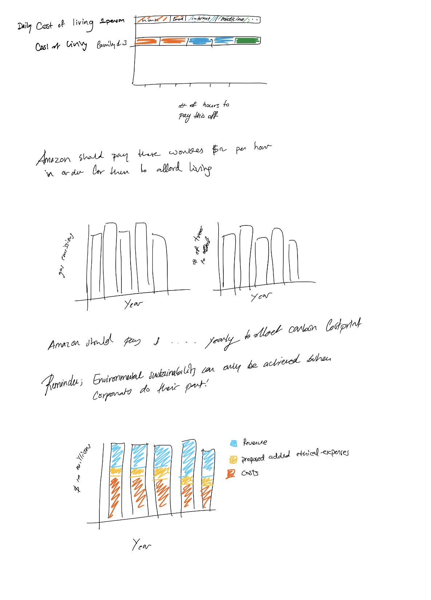

# [Final Project Buthayna AlMulla](https://bamulla.github.io/final_project_ButhaynaAlMulla.md/)

# Is being rich ethical?

## Outline
### Summary
I am interested in looking into whether or not it is possible for a person or a company to be ethically rich. I want to look into amazon and see how much they are making against how much I estimate would cost for them to practice ethical business; (paying livable wages and offsetting the carbon foot print).
### Structure
First I want to capture the viewers attention by highlighting the importance of the topic. This can be done by showing data about how much work the minium wage laborer must do in order to be able to afford living. 

Then I will create a visualization of data that estimates how much it would cost for the company to pay these workers a livable wage, and fix any other unethical practise they have been a part of. 

Finally, I will have a visualization that compares the cost of being ethical to how much a company makes. This could lead to multiple conclusions; one cannot be rich ethically or one can be rich ethically but greed gets in the way.

## Sketches

## Data

First I will collect data about California's minimum wage workers, I will focus this research in one of the areas of Amazon's warehouses and calculate an estimate on the cost of living and compare that to the minimum wage and how many house the person will need to work to cover for themselves, and for a family of three. I would also calculate how much money it would cost of amazon to offset their emissions. Then I will compare these extra costs with how much profit amazon is generating. 

[Amazon number of minimum wage workers](https://www.npr.org/2018/10/02/653597466/amazon-sets-15-minimum-wage-for-u-s-employees-including-temps)
[minimum wage in california](https://www.dwt.com/blogs/employment-labor-and-benefits/2020/12/2021-california-state-local-minimum-wage)
[cost of living in california](https://www.daveramsey.com/elp/cost-of-living-in-california)
[amazon gas emissions](https://www.statista.com/statistics/1056675/ghg-emissions-amazon-globally-by-source/#statisticContainer)
[how many trees needed to offset](https://savingnature.com/offset-your-carbon-footprint-carbon-calculator/)
[how much it would cost to plant those trees](https://onetreeplanted.org/products/andes)
[Amazon Annual income](https://www.statista.com/statistics/266288/annual-et-income-of-amazoncom/)

## Plan for Project Completion
I can create the graphs using flourish and put them together in a website. Depending on how I plan to design the website I could use github for it, or design my own using html/css and maybe bootstrap. 
